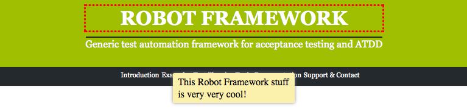

Robot Framework Selenium2Screenshots Library
============================================

:download:`View available keywords <keywords.html>`.

Include keywords with:

.. code:: robotframework

   *** Settings ***

   Library  Selenium2Screenshots

Or:

.. code:: robotframework

   *** Settings ***

   Resource  Selenium2Screenshots/keywords.robot

Importing the keywords wth *Library* keyword may have compatibility issues.

Example of use:

.. code:: robotframework

   *** Settings ***

   Library  Selenium2Library
   Resource  Selenium2Screenshots/keywords.robot

   Suite Teardown  Close all browsers

   *** Keywords ***

   Highlight heading
       [Arguments]  ${locator}
       Update element style  ${locator}  margin-top  0.75em
       Highlight  ${locator}

   *** Test Cases ***

   Take an annotated screenshot of RobotFramework.org
       Open browser  http://robotframework.org/
       Highlight heading  css=#header h1
       ${note1} =  Add pointy note
       ...    css=#header
       ...    This screenshot was generated using Robot Framework and Selenium.
       ...    width=250  position=bottom
       Capture and crop page screenshot  robotframework.png
       ...    header  ${note1}

.. robotframework::
   :creates: robotframework.png

.. note::

   The image cropping requires PIL_ or Pillow_.

.. _PIL: https://pypi.python.org/pypi/PIL
.. _Pillow: https://pypi.python.org/pypi/Pillow

.. note:: All keywords are written as user keywords, but later they may be
   refactored into Python-keywords. If this happens, there will be backwards
   compatible wrappers available as ``keywords.robot``.
